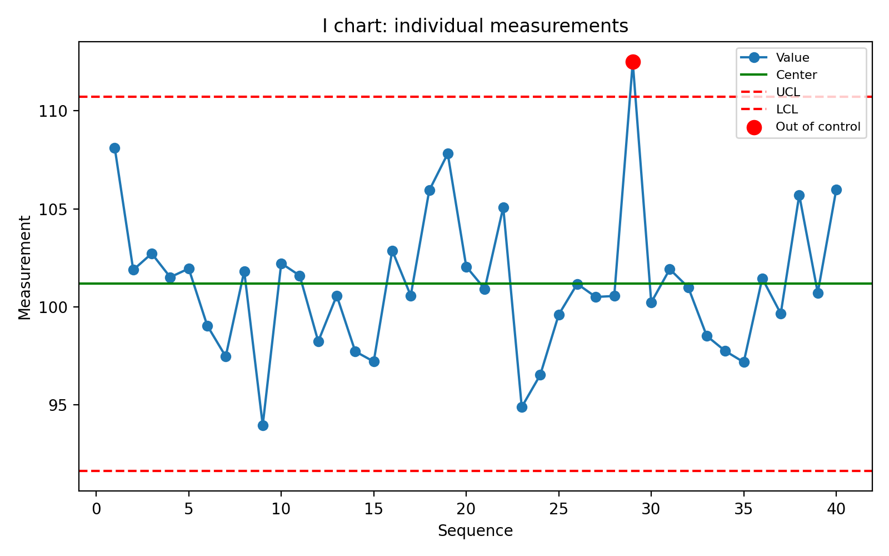
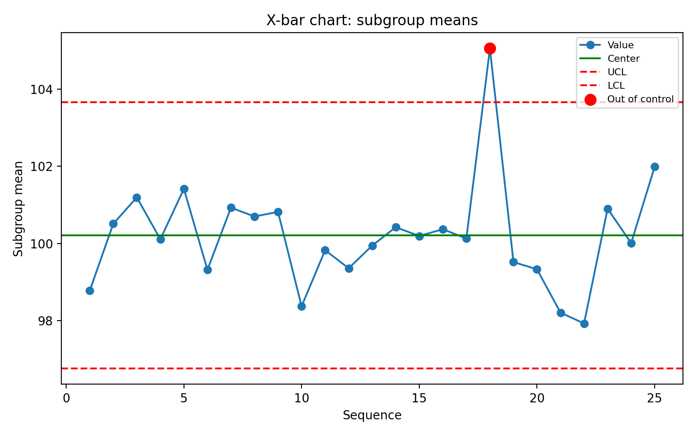
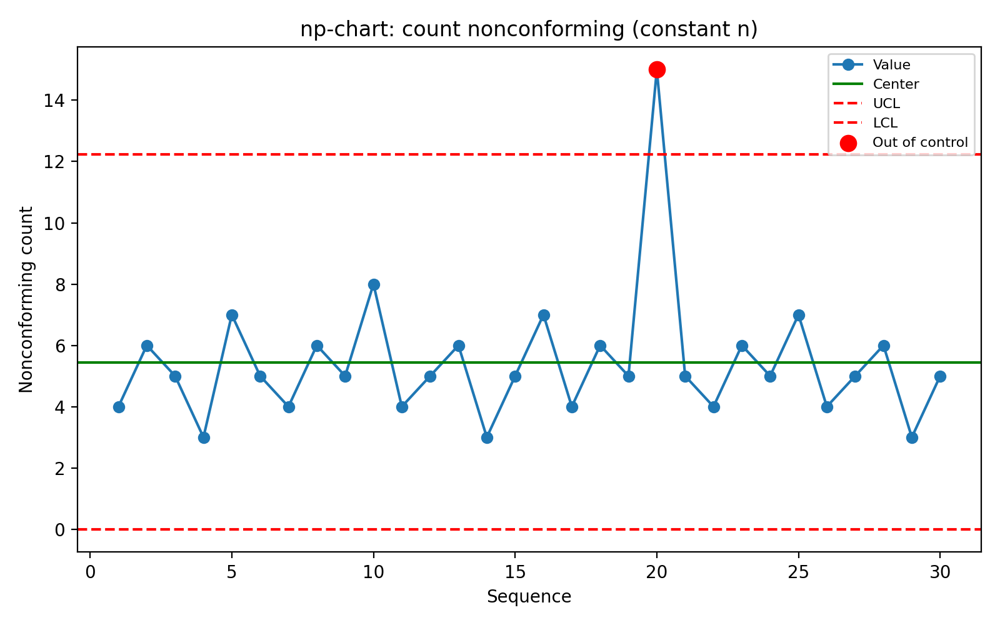
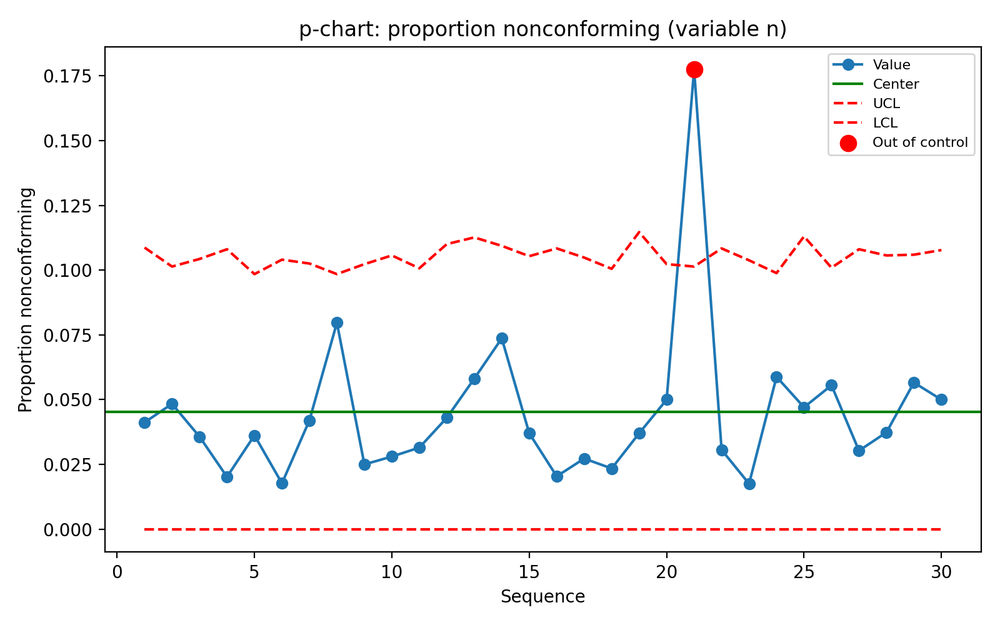

# Statistical Process Control Charts

[](#)
[](#)

Python examples of the common statistical process control (SPC) charts used in
laboratory QC, assay monitoring, manufacturing, and process improvement. Each
chart computes 3-sigma control limits with the standard control-chart constants
and **flags out-of-control points**.

> All datasets are synthetic, for portfolio demonstration only.

## Included chart types

| Chart | Use case | Data type |
|---|---|---|
| I-MR | Individual measurements over time | Continuous single observations |
| X-bar/R | Subgroup means and ranges | Continuous subgrouped data |
| X-bar/S | Subgroup means and standard deviations | Continuous subgrouped data |
| p-chart | Proportion nonconforming | Attribute data, **variable** sample size |
| np-chart | Number nonconforming | Attribute data, **constant** sample size |
| c-chart | Defects per unit | Count data, **constant** opportunity |
| u-chart | Defects per unit | Count data, **variable** opportunity |
| Run chart | Time-ordered trend (median, runs) | Continuous or count data |

## Out-of-control detection
Every chart applies **Rule 1** (any point beyond a control limit); the I-MR and
X-bar charts also apply a **runs rule** (8+ consecutive points on one side of the
center line). Flagged points are drawn in red and counted in the per-chart
summary in `results/`. See `docs/basic_control_chart_rules.md`.

## Quickstart

```bash
python -m venv .venv && source .venv/bin/activate    # Windows: .venv\Scripts\activate
pip install -r requirements.txt
python src/control_charts.py

pip install -r requirements-dev.txt && python -m pytest -q   # run the tests
```

The script writes chart images to `figures/` and control-limit summaries to
`results/`, and prints an out-of-control count per chart.

## Gallery

| | |
|---|---|
|  |  |
|  |  |

## Data note (why this matters)
np- and c-charts assume a **constant** sample size / inspection opportunity, so
they read `attribute_data_constant_n.csv` and `defect_count_constant_unit.csv`.
The p- and u-charts handle **variable** sizes and read `attribute_data.csv` and
`defect_count_data.csv`. Using np/c on variable-size data (as is easy to do by
accident) produces misleading limits.

## Repository structure

```text
├── README.md
├── requirements.txt / requirements-dev.txt
├── data/                     <- synthetic datasets (variable- and constant-size)
├── src/control_charts.py     <- limits, rules, plotting
├── tests/                    <- pytest unit + integration tests
├── docs/                     <- chart selection guide and rules
├── figures/                  <- generated charts (committed for the gallery)
└── results/                  <- generated limit/summary tables
```

## Notes
- Control-chart constants (A2, D3/D4, A3, B3/B4, d2) follow standard SPC tables
  for subgroup sizes 2–10.
- **Control limits are not specification limits** — they describe process
  behavior, not acceptance requirements (see `docs/control_chart_selection_guide.md`).
